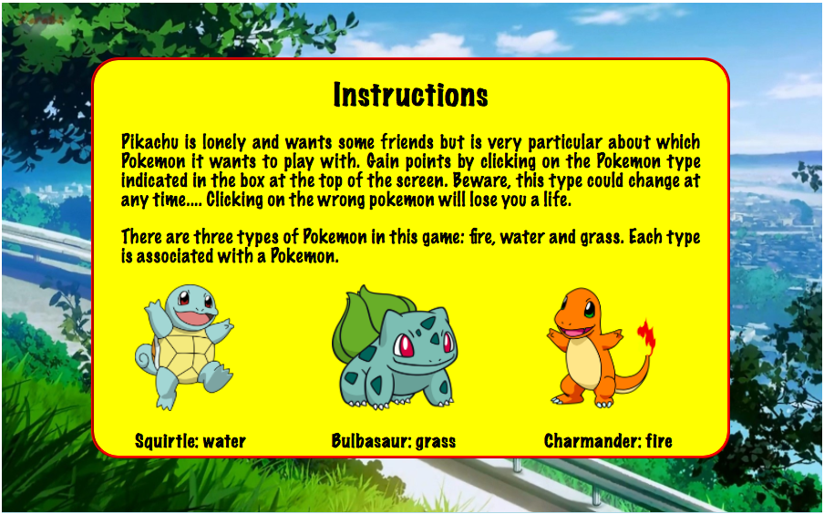
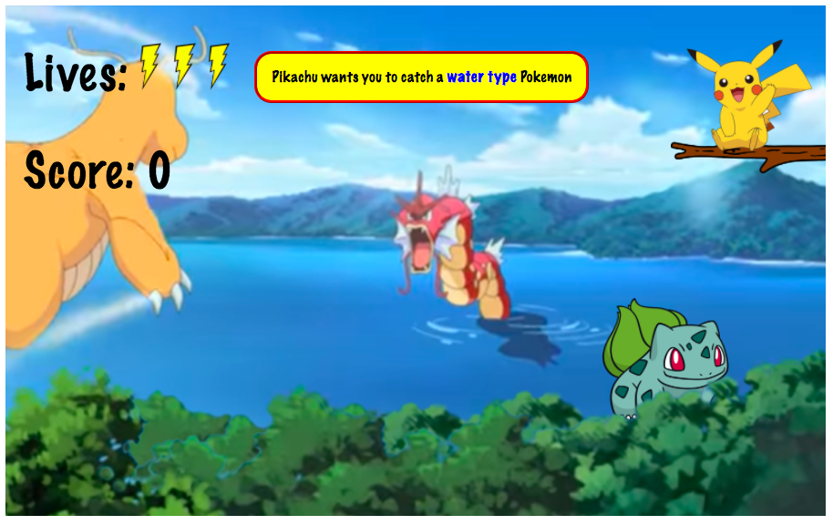
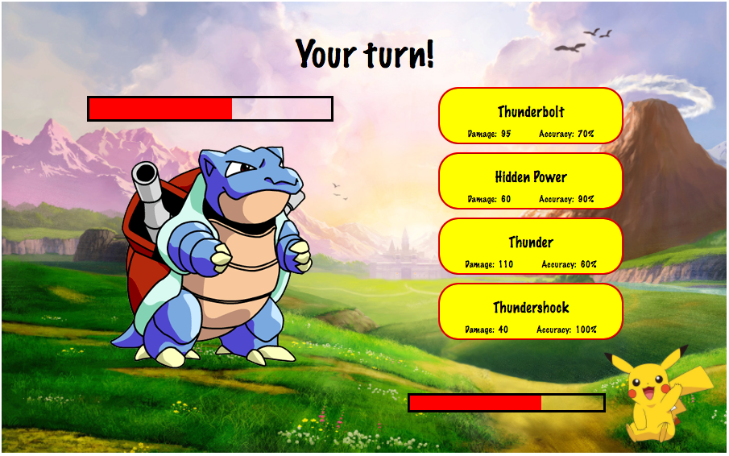
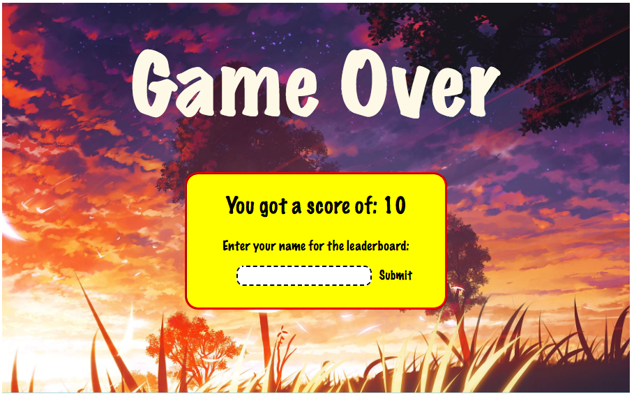

# pikachu-buddies  
--

A pokemon themed point and click game with an additional boss battle.

## How to run  
To run the game, click on this link: https://kippz07.github.io/pikachu_buddies/

## Instructions
Instructions from the game:  
 
Pikachu is lonely and wants some friends but is very particular about which Pokemon it wants to play with. Gain points by clicking on the Pokemon type indicated in the box at the top of the screen. Beware, this type could change at any time.... Clicking on the wrong pokemon will lose you a life.  
There are three types of Pokemon in this game: fire, water and grass. Each type is associated with a Pokemon.  

  

In order: Squirtle - water, Bulbasaur - grass, Charmander - fire  

Occasionally a Blastoise will appear, challenging Pikachu to a battle. You will play as Pikachu and when it is your turn to attack, choose an attack from the selection shown. Each attack does a different amount of damage and has a percentage chance of hitting. If you manage to beat Blastoise you will recieve 30 points. If you lose, the game is over!

## Screenshots  

  
Instructions page  

The main game
  
The boss battle  
  
The end game screen

